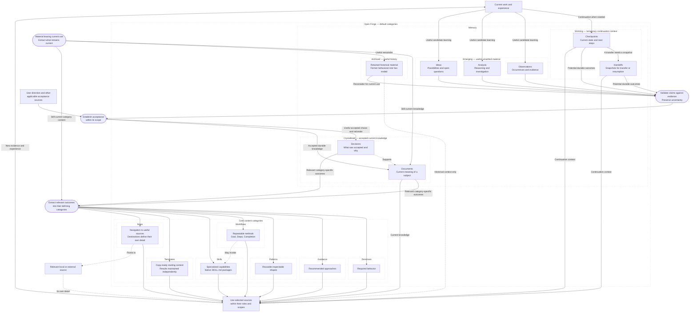

---
open-forge:
  description: Deferred detailed Framework data-flow diagram with named categories and scoped authority distinctions
  tags: [Memory, Idea, Contextual, Candidate, Framework, Review, Diagram]
---

# Detailed diagram idea — framework data flow

Status: deferred idea, not production-ready. On 2026-09-10, the user clarified that both diagrams should remain ideas. Earlier approval to retain this expanded diagram was not approval for production use. This draft explores accepted S02, S03, and S05 direction and the later Workflow discussion through transparent dotted groups, named categories, and nesting from general categories to specialized content. Its [simplified companion](simplified-diagram.md) is also deferred. The diagram content is preserved; its explanation and diagram are not approved README or Framework wording.

## Proposed explanation

Open Forge refines useful experience into accepted knowledge and integrates relevant outcomes into sources with precise responsibilities. Memory preserves working context, candidate learning, accepted knowledge, and useful history. Each source answers its own question within its scope.

Validation establishes whether evidence supports a claim. Acceptance establishes which knowledge or decisions may be treated as current within their scope. Restoring or moving a record does not establish acceptance by itself.

Memory distinguishes the role and state of recorded material. Working preserves temporary continuation context, Emerging preserves useful unsettled material, Crystallized preserves accepted current knowledge, and Archived preserves useful history. Within Crystallized Memory, a Decision records what was accepted and why. A current document explains the accepted subject, supported by relevant Decisions. Evergreen documents stay aligned as the accepted meaning changes.

Relevant outcomes are extracted into the categories that define how they are used. Required behavior belongs in Directives, recommended approaches in Guidance, reusable shapes in Patterns, and repeatable methods in Workflows. These are examples of distinct responsibilities, not a fixed list of destinations. Memory supports those sources without acquiring their roles by recording their content.

Apply each source within its role and selected scope. New evidence and experience can inform further refinement. Changes to accepted meaning require the affected sources to be reconciled; unresolved conflicts are surfaced before dependent work proceeds.

## Proposed diagram

Dotted, transparent containers show category membership, from broad groups to their specialized content. Solid arrows show common information-flow and use relationships. Dotted arrows show supporting, navigation, or optional capability relationships. Rounded nodes are actions, not categories or Memory states.

Working, Emerging, Crystallized, and Archived are peer states within Memory. Their nesting describes specialization, not authority rank. The Core content grouping collects the seven other default root categories for readability; it is not an additional route or directory. This is a category and information-flow diagram, not the loader's traversal graph. Each route may be narrowed further by relevant scopes. Named default categories may be adapted, extended, or removed.

The arrows illustrate useful relationships rather than every permitted transition. They do not require a separate file or visit to every Memory state. Material enters the source appropriate to its established meaning; already accepted direction does not need repeated approval. A Decision and a Document are created or updated only when their distinct questions warrant them. Validation, acceptance, and classification remain distinct judgments, even when completed together. Only relevant outcomes need integration into another category; the outgoing branches do not require updates to all seven categories.

Documents marked Evergreen stay aligned with accepted current meaning. Evergreen is a property, not another category inside Documents. Archived material can inform work as history without restoration to current authority. The archival action applies to material leaving current use wherever it originated; the diagram does not enumerate an archival arrow from every source. Working can retain explicitly accepted temporary choices, and unsettled material can inform investigation without becoming accepted current knowledge.

## Archival

When material should no longer be current, extract its still-current content into the appropriate current sources and archive the remainder worth retaining. The archived material follows its destination's rules. Remove metadata that would continue its former behavioral role or assert current authority. Retention may involve consolidation or transformation; deletion follows the user's direction or accepted retention preferences. Reuse as current material requires current validation and acceptance appropriate to its destination.

## Meaning preserved during integration

- Clear user direction, delegated authority, choices necessarily entailed by authorized action, and declared external authority remain valid acceptance sources. The diagram adds no approval ritual or authority layer.
- Accepted user direction recorded in Memory retains its acceptance and scope. Its record does not become a Directive merely by describing required behavior. Integrate durable outcomes into the sources that define their respective roles before future work relies on those representations.
- A source's role and scope determine its authority. Memory states describe how recorded material is treated; they are not ranked as higher and lower categories. Loading, tags, links, and movement do not grant additional authority.
- A Decision and a current document answer related but distinct questions. Preserve only useful distinct records; update existing sources where they fit rather than creating duplicate accounts.
- Evidence validation assesses claims. It does not decide a user's preferences or substitute for acceptance of a consequential choice.
- The diagram illustrates reusable learning. Temporary accepted choices may remain temporary, and work need not generate durable Memory without useful future value.
- The default categories illustrate responsibilities and remain adaptable. No named record type becomes mandatory or permanently protected through this explanation.
- Workflow and Skill procedures can overlap. Each shared method needs one defining procedure and useful references rather than independently maintained copies.

## Intended source placement

These are inspected integration targets, not edits made by this proposal. Recheck their current contents before preparing patches because the shared checkout has concurrent work.

| Source | Responsibility in the later change |
| --- | --- |
| [Framework acceptance document](../../../crystallized/documents/framework/truth.md) | Explain evidence validation, acceptance, scoped current knowledge, and alignment of affected sources. |
| [Memory model](../../../crystallized/documents/framework/memory/model.md) | Explain refinement, Memory's knowledge authority, and its relationship to category-specific content. |
| [Memory transitions](../../../crystallized/documents/framework/memory/transitions.md) | Define extraction, transition, archival, and restoration without a mandatory file pipeline. |
| [Shipped loader](../../../../../src/open-forge/.agents/loader.md) and [Memory entrypoint](../../../../../src/open-forge/.agents/memory/_memory.md) | State the concise operative rules; reconcile relevant state and category entrypoints without duplicating the explanatory model. |
| [README](../../../../../README.md) | Present the understandable overview and diagram, derived from the reconciled defining sources. |

## Review boundary

The user requested sequential proposals and a stop whenever their answer is needed. Both diagrams are now deferred ideas and are not production-ready. Further diagram refinement or approval is not a prerequisite for the remaining review work. The [review notes](../../../working/framework-review/review-followup-instructions.md) preserve accepted conceptual directions separately from these drafts. No shared source, installed content, Git history, or frozen review evidence changed. Nothing was merged to `develop`.
