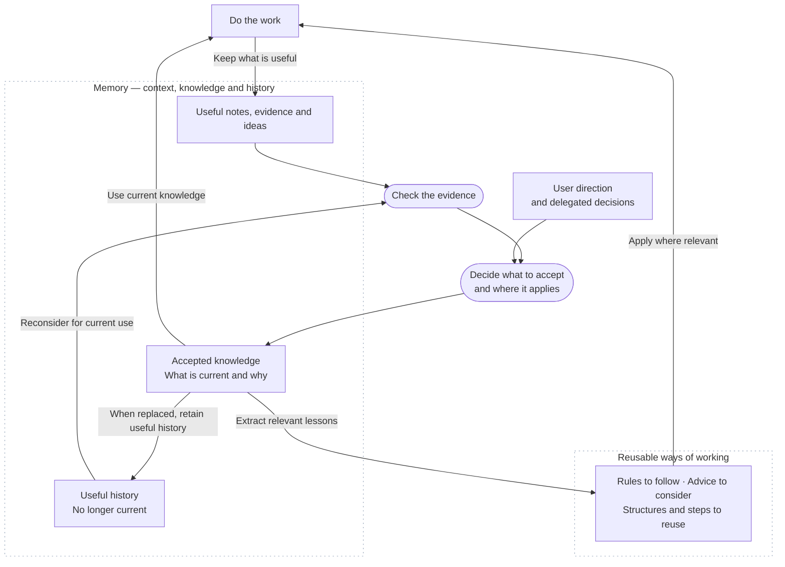

---
open-forge:
  description: Deferred simple Framework data-flow diagram intended for a first-time reader
  tags: [Memory, Idea, Contextual, Candidate, Framework, Review, Diagram]
---

# Simplified diagram idea

Status: deferred idea, not production-ready. On 2026-09-10, the user deferred both the simplified and detailed diagrams and requested keeping them as ideas. This draft targets a first-time reader who has not read the README. Preserve it for later refinement; it is not approved for the README or other production documentation.

## Proposed introduction

Open Forge helps a workspace learn from its work. It keeps useful context, checks evidence, preserves accepted knowledge, and turns relevant lessons into clearer ways of working.

## Proposed diagram

## Proposed caption

Keep useful context. Check what the evidence supports. Accept knowledge and choices within their scope. Preserve the reasons, and put relevant lessons into the sources that define how future work is done. Retain useful history after its current content has been preserved elsewhere.

Memory records knowledge and reasoning. Directives define required behavior, Guidance recommends approaches, Patterns provide reusable shapes, and Workflows describe methods. These are examples of distinct roles. Remembering a rule does not by itself make it an active Directive.

## Deliberate simplifications

- The overview groups temporary context and candidate material together, and groups accepted current knowledge with its useful reasoning. These plain-language labels are not new Memory states or required files.
- The reusable-content box summarizes selected roles. The detailed diagram names all seven default Core content categories and the Memory states and record categories.
- Evidence validation and acceptance remain separate actions. Clear user direction and authorized delegated decisions can establish acceptance without a new evidence investigation or repeated user approval.
- The arrows illustrate the learning cycle, not mandatory file movements or a requirement to create every source. Current knowledge informs work directly; only relevant outcomes need a reusable behavioral or structural destination.
- The single archival arrow illustrates preserving useful history after extracting current content. The detailed model applies this rule to material from other origins as well. History can also inform work as history without being adopted as current knowledge.
- Dotted transparent containers separate Memory from reusable ways of working. Rounded nodes are actions. The diagram avoids ranking Memory states as higher or lower.

The [detailed diagram idea](detailed-diagram.md) preserves the more extensive draft. Both diagrams remain deferred and are not production-ready. Neither defines accepted Framework meaning or approves source wording; use the [review notes](../../../working/framework-review/review-followup-instructions.md) for the user's accepted directions.
