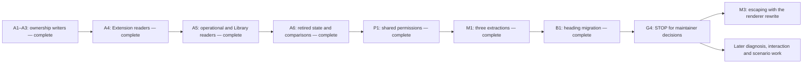

---
open-forge:
  description: Progression report for the completed Task 30 state migration, Task 31 extraction closeout, reviewed divergences and the remaining pre-G4 boundary
  tags: [Memory, Working, CLI, Task, Evidence, Contextual]
---

# Task 30 And Task 31 Progression Report

G1 is complete through A1–A6 and P1. The shared allow list applies to all
Extension and Library owners. M1's three applicable extractions are complete.
B1 is complete: existing generated guards migrate automatically, repository and
payload entrypoints use headings, and Index/Prettier stability is proved. All
managed and supported Windows native suites passed after the final fixture
correction. **Stopped before G4**, which has not been opened.

| Scope                                           | Current result                                                                                                                             | Owning evidence                                                                    |
| ----------------------------------------------- | ------------------------------------------------------------------------------------------------------------------------------------------ | ---------------------------------------------------------------------------------- |
| Earlier Task 30 phases 0–3 and carried 3.5 work | Complete; their historical characterization is not recreated or re-certified here                                                          | [Completed baseline](phase-0-3.md)                                                 |
| A1–A3 review                                    | Reviewed ownership composition and immediate consumers; R3, R5, R6 and R7 corrected                                                        | [Review of done work](04-a4-extension-readers.md#review-of-completed-task-30-work) |
| A4                                              | Lock-backed Extension readers; final-owner deletion with retained recovery; removed `--prune` is an unknown option                         | [A4](04-a4-extension-readers.md)                                                   |
| A5                                              | One ownership observation for Status/Doctor and typed Library registration from the lock                                                   | [A5](05-a5-status-doctor-library-readers.md)                                       |
| A6                                              | Obsolete lifecycle/Library subsystem deleted; current/intended comparisons and ordinary replace/restore behavior                           | [A6](06-a6-delete-lifecycle.md)                                                    |
| P1                                              | Settings is the sole grant authority; all six gated commands expose `--allow-path`; always/once/cancel and under-lease revalidation proved | [P1](06p-p1-shared-permissions.md)                                                 |
| Task 31 M1                                      | Three shared mappings implemented; conditional Library validator group retired; four convention gates met                                  | [M1](../task31/08-m1-enumerated-extractions.md)                                    |
| Task 31 M2/M4                                   | Previously complete                                                                                                                        | [Task 31](../task31-implementation-duplication.md)                                 |
| B1                                              | Heading migration complete; managed/native qualification passed                                                                            | [B1](07-b1-heading-entries.md)                                                     |
| G4, M3 and later phases                         | Not started; G4 needs maintainer attention, M3 belongs with its accepted renderer changes, M5 follows stabilized presentation structure    | [Task 30 phase map](../task30-cli-experience-remediation.md#phase-map)             |

The material review findings are resolved as follows. The linked slice records
own their full evidence and every implementation deviation, including failed
first runs and corrections; this table is a navigation summary.

| Finding                                                                      | Resolution                                                                                                                                     | Record                                                                                                        |
| ---------------------------------------------------------------------------- | ---------------------------------------------------------------------------------------------------------------------------------------------- | ------------------------------------------------------------------------------------------------------------- |
| R1: deletion boundary was not established independently of stale ownership   | Use the maintainer-confirmed shared allow list, implicit `.agents/`, reserved controls and physical checks; no per-extension destination field | [A4 divergences](04-a4-extension-readers.md#divergences-observed)                                             |
| R2: success cleanup removed recovery protection                              | Retain and report the verified recovery bundle after successful removal                                                                        | [A4](04-a4-extension-readers.md#divergences-observed)                                                         |
| R3: new state files were not reserved                                        | Reserve actual settings/lock paths and their descendants                                                                                       | [Done-work review](04-a4-extension-readers.md#review-of-completed-task-30-work)                               |
| R4: portable path aliases could bypass shared ownership                      | Reject ambiguous aliases before effects, preserving all bytes                                                                                  | [A4](04-a4-extension-readers.md#divergences-observed)                                                         |
| R5: Library source-relative receipts were compared as workspace paths        | Map through the declared destination root before ownership comparison                                                                          | [A5](05-a5-status-doctor-library-readers.md#divergences-observed)                                             |
| R6: root managed hosts had incorrect whole-file ownership                    | Record their actual managed regions; preserve authored content outside them                                                                    | [A5](05-a5-status-doctor-library-readers.md#divergences-observed)                                             |
| R7: the lock reader could follow a linked `.agents` parent                   | Observe the parent without following links before and after the read                                                                           | [A5](05-a5-status-doctor-library-readers.md#divergences-observed)                                             |
| R8: accepted shared-permission steps were omitted from the numbered sequence | Added and completed P1 before declaring G1 complete                                                                                            | [A6](06-a6-delete-lifecycle.md#divergences-observed), [P1](06p-p1-shared-permissions.md#divergences-observed) |
| R9: Update help still described old preservation/force behavior              | Captured published help before edits; corrected it and verified native/managed equality                                                        | [P1](06p-p1-shared-permissions.md#divergences-observed)                                                       |

Additional deviations are recorded in those ledgers: omitted Update reader
steps, unavailable snapshot harnesses, migrated legacy fixtures, malformed/cyclic
lock claims, variadic unknown-option handling, serial Integration/EndToEnd
execution, preserved semantic-normalization boundaries, corrected root-region
assertions, missing-parent preflight, raw lock revalidation, shared-grant write
refusals, safe temporary publication, already-covered grant idempotence, exact
recovery before interactive settings Create, and intentionally narrower
EndToEnd coverage. M1 records its conditional group retirement and owner choices.

P1's managed and supported Windows native gates both passed after rebuilding:

| Convention check       | P1 managed                                                                                | P1 native          |
| ---------------------- | ----------------------------------------------------------------------------------------- | ------------------ |
| Unit                   | 3349 passed, failed 0, skipped 0                                                          | Same               |
| Integration            | 1846 passed, failed 0, skipped 17                                                         | Same               |
| EndToEnd               | 131 passed, failed 0, skipped 0                                                           | Same               |
| `npm run check:dotnet` | Exactly five inherited whitespace diagnostics; nonzero exit; chained analyzer did not run | Not a native suite |

Counts describe the evidence and are never pass conditions. M1 Unit, Integration and EndToEnd match those results; its 24 published before/after outputs
are byte-equal after line-ending normalization. M1 adds no tests, fixture edits,
wire changes or dependencies. B1's completed supported Native AOT integration
wave now qualifies those extractions as well.

Before evidence was committed separately: A4 `b56e3d9c`, A5 `fa6019ca`, A6
`b1d93575` plus focused additions, P1 `1d0a7a71` and `badbde7a`. The reviewed A6
snapshot delta covers 50 files (119 additions/176 deletions); P1 covers 36 files
(76 additions/135 deletions), plus the separately reviewed published-help diff.
P1 changes the permissions path, destination strings, owner/source coordinates,
rebinding and recovery path; decision/action/outcome names remain unchanged.
M1's capture has zero output differences. Full reviews and artifact hashes are
in each slice receipt.

M1 qualifies 3349 Unit, 1846 Integration (17 skipped) and 131 EndToEnd tests,
all with failed 0; its format check has the same five inherited diagnostics.

Behavior commits: A4 `70b4a2ff`, A5 `4368148f`, A6 `525f9379`, P1 `c45eace6`,
M1 `bdc6e185`. B1 behavior and this final receipt form one commit after its
separate before snapshot `e3d6777f`.
The implementation was qualified on `task30-a4-extension-readers` before
integration. The maintainer subsequently authorized local integration into
`feature/development-2`, retaining the review follow-ups below. Nothing has been pushed. The delivery test-suite
script remains unchanged. B1 migrated the shipped payload and removed its temporary
Prettier containment.

Intentionally not done: no legacy user state was migrated or deleted; no
per-owner grant adapter, second settings parser, new schema, fingerprint chain,
Git-cleanliness gate, broad all-command test matrix or historical harness was
introduced. M1 does not merge Route Move/Remove findings, human/wire Safety
vocabulary or distinct Library finding types. Axioms absent/empty policy,
TypeScript grammar and loader-content relocation remain deferred Framework
questions; G4 presentation decisions remain with the maintainer.

B1's initial metadata blocker is resolved in `d6a0ac2e`. The maintainer approved
adding required metadata to `.agents/memory/emerging/authors-findings/claude.md`;
its body was preserved byte-for-byte. The first repository Index run applied
143 generated updates, and the second verified all 146 regions with zero updates.
Every changed entrypoint preserved bytes outside the generated boundary.

The requested automatic-metadata work belongs to [Task 30 Phase 5 diagnosis and
interoperability](phase-5-diagnosis-and-interoperability.md), after G4; no calendar
date is recorded. Its linked analysis explicitly includes missing frontmatter
under Index's safe structural fixes, with no additional flag.

The later marker-retirement scope stop is resolved by the maintainer's direction:
fully migrate to headings and retain minimal automatic old-guard detection/removal
for existing projects. Old tokens now remain only in input-migration support,
focused fixtures and historical evidence. B1 records every execution deviation,
including its additional reader consumers, parser consolidation, direct staged-byte
refresh after automatic approval review rejected directory removal, and formatting
scope. Earlier rejected temporary cleanup remains untouched.

B1's reviewed before commit is `e3d6777f`. Its five changed snapshots contain
9 added lines and 21 removed lines: retired fields/marker rows, heading-body byte
coordinates, revised help, and guard-free scaffold bytes. The existing ordinary
Inspect outputs are unchanged. All 169 migrated entrypoint authored prefixes are
byte-exact. Index/Prettier stability was asserted over 60 payload files in both
orders; the repository's second Index run verified 146 regions with zero updates.

B1's final convention results follow; all suites were rebuilt before execution.
The native lane's Unit assembly remains managed, as required by the supported
qualification layout. Counts describe evidence and are never pass conditions.

| Check                  | Managed                                                                        | Windows native qualification |
| ---------------------- | ------------------------------------------------------------------------------ | ---------------------------- |
| Unit                   | 3366 succeeded; failed 0; skipped 0                                            | Same                         |
| Integration            | 1849 succeeded; failed 0; skipped 17                                           | Same                         |
| EndToEnd               | 131 succeeded; failed 0; skipped 0                                             | Same                         |
| `npm run check:dotnet` | Exit 2; exactly five inherited whitespace errors; chained analyzer did not run | Not a native suite           |

Both builds completed without reported warnings or errors. Native Index/Inspect
help matches fresh managed output after LF normalization. B1 owns the validated
source/configuration identity, binary and closure hashes, exact commands, and
managed/native logs. No source, test, fixture, payload or build configuration
changed after the qualifying builds.

The final audit also resolved **B1-R1**, three migrated fixtures that no longer
proved their original ambiguous-boundary/opaque-content premise, and **B1-R2**,
remaining generated-marker wording and an editing typo in current contracts.
The fixture corrections were rebuilt and qualified in all suites; the contract
corrections accompany behavior. Both findings and their dispositions are in
[B1's divergence ledger](07-b1-heading-entries.md#divergences-observed).

The agreed stop remains before G4. Its renderer contract, escaping work, and
later automatic-metadata behavior have not been started.

## Integration Follow-ups

The reviewed tree was merged locally into `feature/development-2` at `e40492aa`.
Subsequent maintainer annotations resolved
[SG-R1 and SG-R2](review-second-gate-pre-g4.md#accepted-disposition-and-follow-ups):
SG-R1 contracts now match current ownership and reserved-path behavior; SG-R2's
legacy-receipt notice requirement was retired. The review record owns the exact
dispositions, verification and divergences. G4 preparation records only obsolete
assumptions that could mislead design. Its output contract and renderer work
remain unaccepted. The AGENTS heading suggestion is a structural follow-up.
