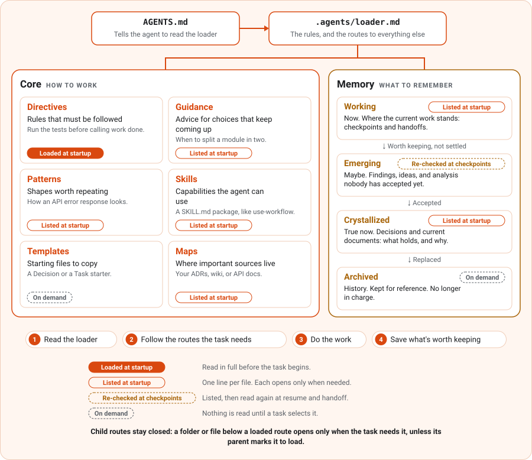

# Open Forge

Open Forge is a small Markdown framework for working with AI agents, built around your projects, your tools, and the way you like to work. It's agent- and harness-agnostic, and the whole design comes from an idea I call **Adaptive Context Engineering (ACE)**. ACE takes progressive disclosure and spec-driven development and applies them to the workspace itself. Each task starts from what you want to achieve, pulls in the context it needs as the work unfolds, and leaves behind what's worth keeping for the next one.

An agent doesn't need to know everything, but it does need to know where everything is. Open Forge gives your workspace a loader and one short entrypoint per folder. An agent starts from the task, follows the routes that matter, and skips the rest. A useful correction, a workflow that saves you time, or a decision you don't want to explain again gets a place in that structure. Scopes keep each piece within reach without bringing the whole collection into every task.

<p align="center">
  <picture>
    <source media="(prefers-color-scheme: dark)" srcset="src/docusaurus/static/img/framework-map-dark.svg">
    
  </picture>
</p>

Everything in the workspace answers one of two questions. **Core** says how work should be done: a rule must be followed, advice can be adapted, a Template is copied and then yours. **Memory** keeps what's worth remembering, and says how far to trust it: current work, unconfirmed findings, accepted knowledge, and history each get their own place.

The base is 15 files and about 7.9k tokens, of which about 5.8k load at startup ([how it's measured](docs/development.md#measure-context-size)). From there, make it yours: keep your favorite tools, add your own ideas, and change the parts that don't fit. The CLI makes maintenance faster, but the files work on their own.

## Get started

Full documentation here: https://thelithiumforge.github.io/open-forge/

Setup has two steps: install the CLI, then use it to install the Framework into your project. The CLI is optional. If you'd rather not use it, skip to [installing the Framework manually](#manually-from-a-clone).

### Install the CLI

The routes are listed from least to most setup.

#### From npm

Needs Node.js 22.18 or later.

```sh
npm install -g @thelithiumforge/open-forge@beta
```

#### From a GitHub release

No Node.js needed. Download `open-forge-<version>-<platform>.tar.gz` from the [releases page](https://github.com/TheLithiumForge/open-forge/releases), where the platform is `linux-x64`, `linux-arm64`, `osx-x64`, `osx-arm64`, `win-x64`, or `win-arm64`. Check it against the release's `SHA256SUMS` and extract it. For example, on Linux:

```sh
sha256sum --check --ignore-missing SHA256SUMS
tar -xzf open-forge-<version>-linux-x64.tar.gz
```

The archive holds a single `open-forge` executable (`open-forge.exe` on Windows) and its license. Put it on your `PATH`, or keep it in your repository, for example as `tools/open-forge`, and run it from there as `./tools/open-forge`.

#### From source

Clone this repository and follow the [local setup guide](docs/development.md#link-the-native-cli-locally) to build and link the CLI.

### Install the Framework

Both routes install the same Framework files. The CLI also records what it installed, so it can update those files later.

#### With the CLI

From your project (use `./tools/open-forge` instead if you kept the binary in your repository):

```sh
open-forge install --dry-run
open-forge install
```

The dry run lists what will be written.

#### Manually, from a clone

No CLI needed. The Framework is complete in [src/open-forge](src/open-forge/). Clone this repository and copy it into your project:

```sh
git clone https://github.com/TheLithiumForge/open-forge.git
cp -R open-forge/src/open-forge/.agents /path/to/your-project/
cat open-forge/src/open-forge/AGENTS.md >> /path/to/your-project/AGENTS.md
```

If your harness reads `CLAUDE.md`, append `open-forge/src/open-forge/CLAUDE.md` to your project's `CLAUDE.md` as well. If the project already has a `.agents/` folder, merge the two by hand instead of copying over it.

### After installing

Whichever route you took, review the result with `git diff` and commit it. That's the whole setup. Installing and updating are things you do when maintaining the workspace. Agents don't repeat them at startup.

Now give your agent a real task. It starts at `AGENTS.md`, reads the loader, follows the routes relevant to the task, and works within their rules. You don't need a spec up front. Start with the request and add detail as the work calls for it.

Adding it to an existing codebase? Point a Map at the docs you already have, and record Decisions from your next change on. You can't decide what was already decided before you arrived, but every change from now on can keep its reasons. The [new or existing project guide](https://thelithiumforge.github.io/open-forge/docs/getting-started/greenfield-and-brownfield) covers both cases, and the [demos](demos/) let you try each one.

## What you get

```text
AGENTS.md                         <- tells the agent to read the loader first
CLAUDE.md                         <- bridge for harnesses that read CLAUDE.md
.agents/
  loader.md                       <- routing and loading rules, and the root routes
  directives/_directives.md       <- required behavior
  guidance/_guidance.md           <- advice for recurring choices
  patterns/_patterns.md           <- reusable shapes for code, files, and documents
  skills/_skills.md               <- native SKILL.md capabilities
  skills/open-forge-cli/SKILL.md  <- how to use the CLI, loaded when needed
  templates/_templates.md         <- copy-ready starting files
  maps/_maps.md                   <- pointers to important local and external sources
  memory/
    _memory.md                    <- what is worth remembering
    working/_working.md           <- temporary state for active work
    emerging/_emerging.md         <- useful, but not settled yet
    crystallized/_crystallized.md <- accepted knowledge that stays current
    archived/_archived.md         <- history that no longer governs current work
```

Each entrypoint says what its category is for and the rules for using it, then lists what's inside. Apart from Memory's four states and one Skill that teaches agents the CLI, every category starts empty. The routing matters more than the number of files. The content comes from your work.

Startup loads the shared routing and Memory context. Everything more specialized is selected when a task needs it. The numbers above cover the base. Installed Extensions and your own content add to them.

Read these files once now, and again after each update. They're short, and they become instructions your agents will follow.

They're also yours. Add, adapt, replace, or remove the defaults as your needs change. A removed default stays removed unless you ask to restore it.

Edit a shipped file directly when you want a different version. Keep in mind that `open-forge update` brings changed Framework files back to the current version and reports each one it replaces. For a local change that should survive updates, put it in an adjacent `{name}.overwrite.md` instead. It loads right after its base file and shares that file's role, scope, and loading behavior. Where the two answer the same question, the overwrite wins, and updates leave it alone.

## Grow your own framework

Say your agent keeps calling work done without running the tests. Create `.agents/directives/testing.md`:

```md
---
open-forge:
  description: Run the tests before calling a change done
  tags: [LoadNow, Directive, Testing]
---

# Testing

## Instructions

- Run the test suite before reporting a change as done, and include the result.
```

Then run `open-forge index`, or replace the `none` placeholder under `Entries` in `.agents/directives/_directives.md` with the line it would generate:

```md
- [Run the tests before calling a change done](testing.md) - #LoadNow #Directive #Testing
```

Directives load at startup, so every task now begins with that rule in context.

The same move works for everything your project keeps teaching you:

- A correction you keep repeating can become a Directive, or Guidance if it's advice rather than a rule.
- A structure that makes mistakes easy to spot can become a Pattern or a Template.
- A method that keeps paying off can become a workflow recipe behind the `use-workflow` Skill.
- A specialized capability can become a Skill.
- A useful finding or an accepted decision can become Memory that later work builds on.

**Scopes keep this growth cheap.** Put frontend conventions in a frontend scope and database rules in a database scope. A task selects the branches it needs, and a task that spans both follows both on purpose. Each scope holds only what helps there. There's no fixed limit on how many scopes you add or how deep they go. Active context follows the selected routes and their links, so adding knowledge doesn't mean every task reads more of it.

## Why it works this way

ACE combines two ideas that already work well:

- **Progressive disclosure:** show the next useful level of detail, not everything at once.
- **Spec-driven development:** make goals, constraints, and expected results explicit enough to guide the work and check the result.

ACE applies both to the workspace itself. A task starts from what you want to achieve. As the work unfolds, the agent pulls in what it needs, such as the relevant architecture, your local conventions, or the decision you made last month, and unrelated history stays out. What you learn along the way can become part of the framework, so the next task starts from a better place. Context isn't every file in the repository. It's the knowledge, rules, and current state a task actually needs.

It's plain Markdown on purpose. AI made code cheap to write, and review became the bottleneck, so the framework you work in should be easy to read, diff, and version with the rest of your project. There's no hidden database, no agent runtime, and nothing specific to one vendor.

It's small on purpose too. Big predefined methodologies assume everyone works the same way, and nobody does. My use cases differ from yours, and yours differ from the next person's. Open Forge gives you a handful of rules and a structure that scales, then leaves the rest to you.

That's also why the base stays small and specialized capabilities live in Extensions. Core and Memory cover what every workspace needs: routing, loading, a few content roles, and a place to remember things. Methods for planning, development, project documents, or coordinating several agents are optional packages. You install the ones that fit your work and skip the rest. Once installed, an Extension is just more files in your workspace, and you can adapt it like anything else.

It also works with a mix of agents and tools. Each tool keeps its own interface, and the Framework gives their shared context a place to live. Development is its proving ground, not its boundary. The same structure can support research, design, operations, a personal knowledge vault, or several projects managed together.

## What goes where

The Framework has two parts. **Core** defines routing, loading, and a few reusable content roles. **Memory** keeps useful context as the work evolves.

Each Core category answers one question:

| Category                                                       | Question it answers                                                         |
| -------------------------------------------------------------- | --------------------------------------------------------------------------- |
| [Directives](src/open-forge/.agents/directives/_directives.md) | What behavior is required in this scope?                                    |
| [Guidance](src/open-forge/.agents/guidance/_guidance.md)       | What approach is recommended, and when does it fit?                         |
| [Patterns](src/open-forge/.agents/patterns/_patterns.md)       | What reusable shape makes related work easy to create and inspect?          |
| [Skills](src/open-forge/.agents/skills/_skills.md)             | Which specialized capability would help with this work?                     |
| [Templates](src/open-forge/.agents/templates/_templates.md)    | What starting content can be copied, adapted, and maintained independently? |
| [Maps](src/open-forge/.agents/maps/_maps.md)                   | Where is a useful local or external source, and when should it be used?     |

Patterns do more than they seem to. When work follows the local pattern, that's a quiet sign it's probably right. When it doesn't, the drift stands out in review.

A Skill provides a specialized capability through its native `SKILL.md` package. Repeatable methods aren't a Core category. The optional Workflow Support Extension adds a `use-workflow` Skill whose catalogue holds them. Combine whatever suits the work.

[Memory](src/open-forge/.agents/memory/_memory.md) asks: **What is worth remembering for current or future work?** Its default states separate temporary context, unsettled findings, accepted knowledge, and history:

| State                                                                       | Question it answers                                                         |
| --------------------------------------------------------------------------- | --------------------------------------------------------------------------- |
| [Working](src/open-forge/.agents/memory/working/_working.md)                | What temporary context is needed to continue or resume this work?           |
| [Emerging](src/open-forge/.agents/memory/emerging/_emerging.md)             | What is useful but still unsettled?                                         |
| [Crystallized](src/open-forge/.agents/memory/crystallized/_crystallized.md) | What accepted knowledge should remain current within this scope?            |
| [Archived](src/open-forge/.agents/memory/archived/_archived.md)             | What useful history should remain available without governing current work? |

Records move between states as their usefulness changes, and they don't have to pass through every state. People and agents save findings, review them, merge related knowledge, and retire what's no longer needed.

One rule keeps this from turning into a pile of notes: each source defines only its own part of the truth. A Decision records what was chosen and why. A current document explains its subject as it is now. Required behavior belongs in Directives or inherited Axioms, and writing an instruction into Memory doesn't make it a Directive. When something is accepted, update the source that defines it and keep the useful reasoning in Memory.

## Frontmatter and tags

Routed Markdown files carry a little frontmatter to help readers, human or agent, decide what to open and what belongs where. An architecture document might begin like this:

```yaml
---
open-forge:
  description: Understand the service boundaries and how requests move through the system
  responsibility: Define the current service structure and dependency boundaries
  tags: [Memory, Document, Architecture]
---
```

The **description** helps a reader decide whether to open the file. The optional **responsibility** helps an editor decide what belongs in it. Tags help with selection and search, and a few of them have defined behavior:

| Tag                           | Meaning                                                                               |
| ----------------------------- | ------------------------------------------------------------------------------------- |
| `LoadNow`                     | Read the entry when its parent route loads                                            |
| `KeepInMind`                  | Read exposed continuity context, then refresh it while its scope stays active         |
| `Contextual`                  | Treat useful context as unaccepted unless applicable authority establishes acceptance |
| `CurrentTruth`                | Identify accepted current state within its stated scope                               |
| `Evergreen`                   | Keep the content aligned with the current state it represents                         |
| `Core`, `Memory`, `Extension` | Identify the part of the Framework or package the content relates to                  |

Tags don't grant authority. Loading tags act only through a parent that is already loaded, so they can't pull in a scope nobody selected. Any other tag is yours to describe your own subjects, and it adds no loading behavior.

Each routed folder has an **entrypoint**, normally `_{folder-name}.md`, with short links under `Entries`. Those links are the next choices an agent can make. The [loader](src/open-forge/.agents/loader.md) has the complete routing and tag rules, and the [Markdown reference](.agents/memory/crystallized/documents/framework/markdown/syntax.md#frontmatter) covers the format.

## The CLI

The CLI is an accelerant, not a requirement. Everything it does, you can do by editing files. It speeds up the repetitive parts, such as finding context, keeping navigation correct, and updating the Framework, and it shows planned changes before it writes them.

| When you want to                       | Run                                                | Because                                                                  |
| -------------------------------------- | -------------------------------------------------- | ------------------------------------------------------------------------ |
| See what your agent will load          | `open-forge context`                               | You can check that a new rule reaches the agent before blaming the model |
| Find what the workspace already knows  | `open-forge find --tag=Decision`                   | Reusing a decision beats making it again                                 |
| Add a scope or a record                | `open-forge route init`, `open-forge route create` | Frontmatter and navigation are right from the start                      |
| Rebuild navigation after editing files | `open-forge index`                                 | Entries are how agents find things, so stale ones hide knowledge         |
| Check that everything still fits       | `open-forge status`, `open-forge doctor`           | Broken links and stale navigation show up before an agent trips on them  |
| Pick up a new Framework version        | `open-forge update --dry-run`                      | Every file it would replace is listed, so your edits aren't lost quietly |
| Remove a default for good              | `open-forge remove <path> --dry-run`               | Later updates respect the removal                                        |

Commands that change files offer `--dry-run`, so you see the plan before anything is written.

Your agent can use it too. The loader lists the main commands, and the base ships an `open-forge-cli` Skill that teaches an agent which command fits which job and how to use it safely. The Skill loads only when a task needs it, so harnesses without native Skill support still get the command list from the loader.

[Working with the CLI](https://thelithiumforge.github.io/open-forge/docs/cli) walks through these flows and when each one helps, and the [CLI reference](docs/cli.md) covers every command and option.

### Without the CLI

Follow the links, edit the files, and keep each `Entries` list in step with the files it points to. That's all the Framework itself needs.

The Framework explains itself through its own files. This README and the guides are here to help you get acquainted. The rules you need to understand and use Open Forge live in the files themselves.

## Extensions

Extensions are optional packages of content you can install and then adapt. The [first-party catalogue](src/extensions/README.md) has the full details and dependencies:

| Package                   | What it's for                                                                          |
| ------------------------- | -------------------------------------------------------------------------------------- |
| Core Templates            | Starting files for your own directives, guidance, patterns, skills, and memory records |
| Collaboration             | Exploring ideas, comparing alternatives, and clarifying decisions through discussion   |
| Project Documents         | Vision, architecture, principles, and other current project documentation              |
| Planning                  | Ideas, analysis, decisions, tasks, plans, backlogs, and checkpoints                    |
| Flows and Scenarios       | User journeys, expected outcomes, and records of what happened when they were tried    |
| Observations and Handoffs | Saving observations and leaving a clear snapshot for whoever resumes the work          |
| Development               | Implementing, debugging, and reviewing with the project's existing tools               |
| Task Coordination         | Coordinating related tasks, their dependencies, and the combined result                |
| Workflow Support          | Finding and following installed workflows through the `use-workflow` Skill             |

Every package had to earn its place by doing something a capable agent wouldn't reliably do on its own: a method that changes the outcome, a record that keeps what would otherwise be lost, or a starter that makes the right shape obvious. The packages are split the way people choose them, so you install what helps and nothing else.

Not sure where to start? On an existing codebase, start with **Planning** for its Decisions, which keep the reasons behind changes. To write your own rules, start with **Core Templates**. **Development Toolkit** installs Project Documents, Planning, Flows and Scenarios, and Development together. Task Coordination stays a separate choice, because coordinating many agents is a bigger commitment to one way of working.

An Extension is a way to ship files. Routed files take on the meaning of the route they're installed into. Native files, such as a `SKILL.md`, follow the tool that uses them. Packaging adds no authority.

The [Extensions section of the site](https://thelithiumforge.github.io/open-forge/docs/extensions) explains what every package installs and why, and the [Extension guide](docs/extensions.md) covers installing a package, copying its files by hand, and creating your own.

### The document flow

Project Documents and Planning together add an opinionated flow for project knowledge. A Decision records a change: what was chosen, and why. When you accept it, the documents it affects are updated to say what's true now. The document links to the Decision for the reason, and the Decision links to the document for the result.

Documents are kept top-down:

```text
Vision                        why it exists, for whom, what the first version does
└─ Architecture               the parts, what each owns, the rules they all keep
   └─ component docs, scenarios   exact behavior and expected results
      └─ code and tests

Decisions sit beside the stack and link to the level that holds their result.
```

Top-level documents give an overview of the whole and summarize the narrower documents they link to. Each narrower document explains its own part in more detail and links back up. When a change lands in the detail, the summaries above it are updated too, so the top always gives the current picture. The current answer is one read away, and the reason behind it is one link away.

This flow is the Extensions' opinion, not Core's. Core only asks that detail live in the narrowest source that defines it, and Memory's states work the same without it. [The document flow](https://thelithiumforge.github.io/open-forge/docs/extensions/document-flow) walks through an example.

## What Open Forge doesn't do

Some limits to know before you adopt it:

- **It doesn't make a model deterministic.** Open Forge makes the right context cheap to find and the rules explicit. An agent can still misread or skip them, so review stays with you.
- **It depends on your harness reading `AGENTS.md`** (or `CLAUDE.md` through the bridge). Everything starts there.
- **It isn't a methodology.** There's no mandatory workflow, role, or ceremony. Extensions offer methods, but installing one doesn't make its methods required.
- **It doesn't record everything.** Memory holds what's worth keeping, and agents save outcomes deliberately rather than logging every conversation.

## Go deeper

- [Documentation site](https://thelithiumforge.github.io/open-forge/): getting started, concepts, and a file-by-file tour of every Extension.
- [Demos](demos/): try Open Forge on a new project and on a half-built one, with checks for the result.
- [CLI guide](docs/cli.md): everyday commands and maintenance.
- [Extension guide](docs/extensions.md): packages, dependencies, and customization.
- [Development guide](docs/development.md): local setup, contributions, and verification.

This repository uses Open Forge to build Open Forge, so its own documents double as a working example: [Vision](.agents/memory/crystallized/documents/vision.md), [Principles](.agents/memory/crystallized/documents/principles.md), [Framework Architecture](.agents/memory/crystallized/documents/framework/architecture.md), [Memory](.agents/memory/crystallized/documents/framework/memory/model.md), and the [writing guides](.agents/memory/crystallized/documents/maintenance/writing.md#choose-the-voice).

[MIT license](LICENSE).
